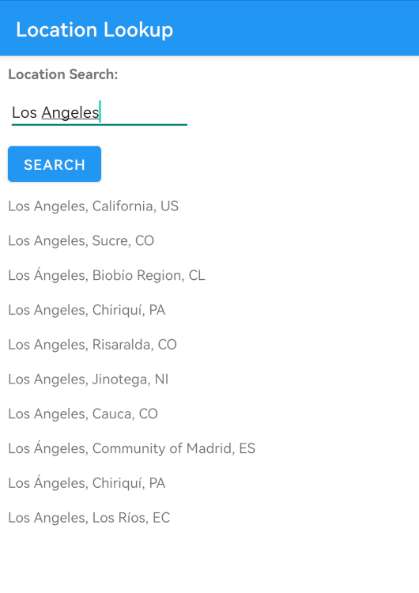
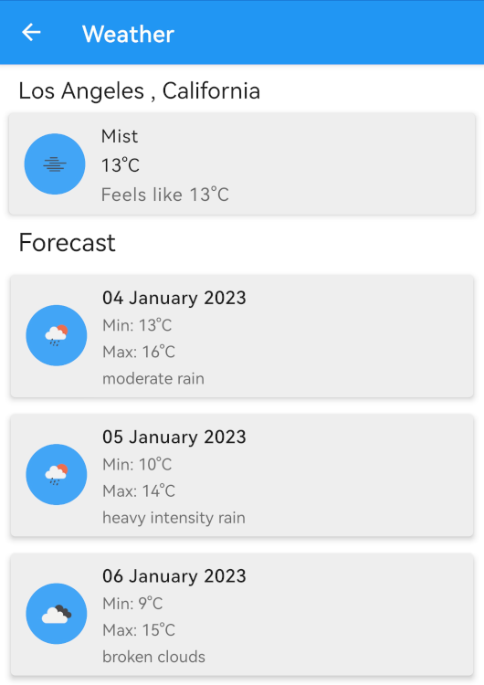

# About Me

Hi, I'm Aidan Brent, a Junior Android Developer with a focus on the Kotlin Language.

Growing up, I always had a proclivity for computers and technology. This extended into High School where I studied Information Technology, learning the Delphi programming language aswell as SQL. Post school, I took courses on Web Design using HTML, CSS and Javascript.

While my career at the time was in In-Person Sales, I kept working on improving my programming skills and eventually used them to assist my employer at the time by helping develop a Web Storefront during the Covid lockdown and beyond, to continue selling their products in a time of uncertainty. This also entailed developing software to integrate the website with their existing POS systems. Software which they are still using to this day.

By doing this I came to realize that my passion truly lied with programming, and have focused on improving my skills since. I've laid my focus on Android and Kotlin as I've seen the potential that the language and platform brings, while still being concise and modern.

# My Projects

## Unit Converter [https://github.com/AidanBrent/Converter]

An android app that converts a wide range of units between each other, for example from Pounds to Kilograms. 

Skills Demonstrated: 
`Fragments` `View Binding` `View Model` `Recycler View` `Coil` `Live Data`  `MVVM`  

   
  

## Weather App [""]

An android app that gives the current weather and a 7-day forecast for any location, sourced from OpenWeatherMap

Skills Demonstrated: 
`Coroutines` `REST API (Retrofit)` `Coil` `Data Binding` `Fragments` `View Model` `Recycler View` `Live Data`  

   
  

