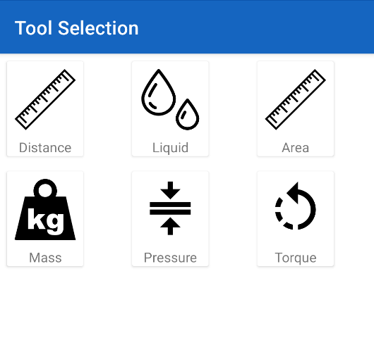
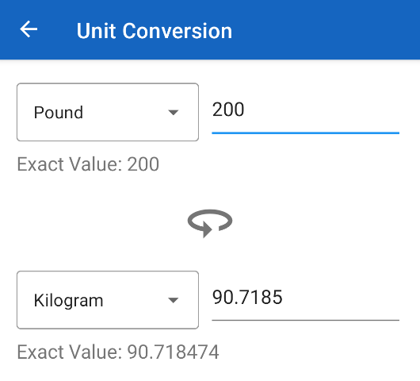

# Unit Converter [https://github.com/AidanBrent/Converter]

<u>Skills Demonstrated</u>

<table>
<tr>
<th>
<ul>
  <li>Fragment</li>
  <li>Viewmodel</li>
  <li>Recycler View</li>
  <li>MVVM</li>
</ul>
</th>
<th>
<ul>
  <li>Coil Library</li>
  <li>Live Data</li>
  <li>Recycler View</li>
  <li>View Binding</li>
</ul>
</th>
</tr>
</table>

   
  

